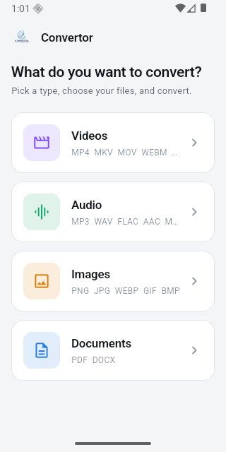
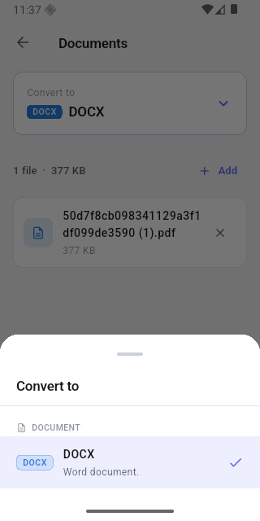
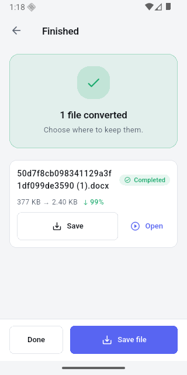

<div align="center">
  
  <h1>Convertor</h1>
  <p><strong>An offline file converter for Android and Linux.</strong></p>
  <p>Video, audio, images and documents — converted entirely on your device.<br>
  No upload, no account, no server. It works with the network switched off.</p>
</div>

<div align="center">
  
  
  
</div>

---

## Why it exists

Most converters upload your files to someone else's machine. That is a poor
trade for a boarding pass, a payslip, or anything else you would rather not hand
over. Convertor does the work locally with a native engine built on FFmpeg and
poppler, so nothing leaves the device.

## What it converts

| From | To |
|---|---|
| **Video** — MP4, MKV, MOV, WebM, AVI, WMV, FLV, TS, M4V, 3GP, MPEG, OGV | any video container, or any audio format |
| **Audio** — MP3, WAV, FLAC, AAC, OGG, M4A, Opus, WMA, AIFF | MP3, WAV, FLAC, AAC, OGG, M4A, Opus |
| **Images** — JPG, PNG, GIF, BMP, WebP, TIFF, ICO, AVIF | any image format, or PDF |
| **Documents** — PDF, Word (DOCX) | each other, both directions |

Two deliberate omissions. **A video will not give you a still image** — one
arbitrary frame is rarely what anyone actually wanted. **Documents are Word and
PDF only**, because those are the two conversions worth doing well.

The picker only ever offers conversions the engine can genuinely perform; a test
asserts that, so the UI cannot drift ahead of the engine.

## How it is put together

A Flutter UI drives a native C++20 engine through a flat C API:

```
Flutter UI  →  ConversionService  →  dart:ffi  →  libconvertor.so
                                                      │
                                        FFmpeg · poppler · libzip
```

On Android the engine and every one of its dependencies are cross-compiled and
linked statically into a single `libconvertor.so` per architecture, so the app
has no runtime dependency beyond Android's own system libraries.

**[engine/ARCHITECTURE.md](engine/ARCHITECTURE.md)** explains the whole design:
the layering, every module, how a conversion flows through it, and why each
third-party library is there.

---

## Running it

```bash
cd offlineconvertor
flutter pub get

flutter run -d android     # phone or emulator
flutter run -d linux       # desktop
```

The prebuilt engine libraries are committed, so this works from a fresh clone
without building any C++.

> If the results screen shows a warning that *"the conversion engine is not
> connected"*, the app failed to load `libconvertor.so` and fell back to a mock
> that writes placeholder files. Build the engine for your platform (below).

## Building the engine

### Linux

Needs FFmpeg, poppler and libzip development packages from your distribution.

```bash
cd engine && cmake -B build && cmake --build build -j
cp build/libconvertor.so.1.0.0 ../offlineconvertor/linux/
```

This also produces `convertor_cli`, which runs conversions without Flutter and
is the quickest way to reproduce a problem:

```bash
./build/convertor_cli convert input.pdf output.docx
./build/convertor_cli probe   video.mp4
./build/convertor_cli formats
```

### Android

Android ships none of these libraries, so all twelve are cross-compiled with the
NDK. Run per architecture, in order — each stage links against the last:

```bash
cd engine/android
./scripts/build_x264.sh    arm64-v8a   # H.264 encoder
./scripts/build_codecs.sh  arm64-v8a   # LAME, Vorbis, Opus, libwebp, libvpx
./scripts/build_docdeps.sh arm64-v8a   # libiconv, FreeType, libzip, poppler
./scripts/build_ffmpeg.sh  arm64-v8a   # FFmpeg, against everything above
./scripts/build_engine.sh  arm64-v8a   # → app/src/main/jniLibs/arm64-v8a/
```

Repeat with `x86_64` for emulators. The last script installs straight into the
Flutter app, so the next build picks it up.

**[engine/android/README.md](engine/android/README.md)** covers the details and
the non-obvious decisions — why x86_64 gives up its assembly, why
`-Wl,--exclude-libs,ALL` is required to link at all, why libiconv is built.

### Releasing

```bash
cd offlineconvertor
rm -f android/app/src/main/java/io/flutter/plugins/GeneratedPluginRegistrant.java
flutter build apk --release --target-platform android-arm64,android-x64
```

Deleting the generated registrant matters: a test run rewrites it to include
`integration_test`, which release builds exclude, and Gradle then fails on a
missing package. For the same reason, do not run `flutter test` and
`flutter build` at the same time — they race on that file.

Built for **arm64-v8a** and **x86_64** only. Every other ABI is excluded, so no
device can install a build with no engine behind it.

---

## Repository layout

```
engine/                  the native conversion engine (C++20)
  include/convertor/     public API — the only headers the FFI layer may include
  src/core/              formats, errors, logging — depends on nothing
  src/ffmpeg/            RAII wrappers; the only place FFmpeg headers appear
  src/document/          every converter, and the document read/write pipeline
  src/jobs/              worker pool, queue, job lifecycle
  src/ffi/               the extern "C" surface Dart calls
  tools/                 convertor_cli
  android/scripts/       NDK cross-compilation
  tests/

offlineconvertor/        the Flutter app
  lib/services/          the engine boundary (real FFI + a mock for UI work)
  lib/core/constants/    format catalogue — mirrors the engine's
  lib/providers/         the state machine for one conversion batch
  lib/features/home/     category → configure → progress → results
  test/                  unit tests, plus tests that drive the real engine
  integration_test/      the same, on a device
```

## Testing

```bash
cd engine/build && ./convertor_tests           # engine unit tests
cd offlineconvertor && flutter test            # 55 Dart tests
flutter test integration_test/ -d <device>     # on a real device or emulator
```

Two properties are worth knowing about, because they catch whole classes of bug:

- **The UI cannot drift from the engine.** A test asks the engine what it
  supports and asserts the app offers nothing more.
- **Outputs are validated, not counted.** Media is fully decoded, images are
  checked against their magic bytes, PDFs are re-read with poppler, and Word
  files are checked for their required package parts. *"It produced a file"* is
  not evidence — an earlier version of this app produced files that were empty,
  and `.png` files that held JPEG data.

Current state: 258 conversion pairs pass on Linux with every output validated,
26 pass on an Android emulator, alongside the unit and integration suites.

## Licensing

The engine links **libx264** for H.264 encoding, which is **GPL**. That makes
the app as a whole GPL. FFmpeg ships no H.264 encoder of its own, so the
alternatives are to accept the licence, drop MP4/H.264 output for the MPEG-4
Part 2 encoder, or use the device's hardware encoder through MediaCodec. The
choice lives in one line of `engine/android/scripts/build_ffmpeg.sh`.
